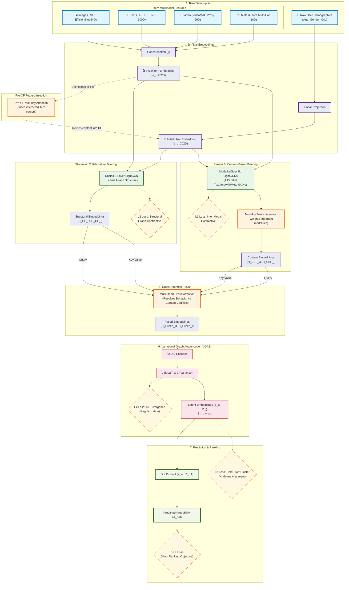

# MM-CLightRec Architecture Diagram

Below is the complete architectural flow of our model. You can copy this visual structure directly into Draw.io or use this Mermaid diagram for your paper!

```mermaid
graph TD
    %% Styling
    classDef input fill:#e1f5fe,stroke:#0277bd,stroke-width:2px;
    classDef embed fill:#e8eaf6,stroke:#4a148c,stroke-width:2px;
    classDef module fill:#e8f5e9,stroke:#1b5e20,stroke-width:2px;
    classDef attention fill:#fff3e0,stroke:#e65100,stroke-width:2px;
    classDef vgae fill:#fce4ec,stroke:#b71c1c,stroke-width:2px;
    classDef loss fill:#fff8e1,stroke:#f57f17,stroke-width:2px,stroke-dasharray: 5 5;
    classDef output fill:#f1f8e9,stroke:#33691e,stroke-width:3px;

    %% 1. Raw Inputs
    subgraph Inputs ["1. Raw Data Inputs"]
        U_raw["👥 Raw User Demographics<br>(Age, Gender, Occ)"]:::input
        
        subgraph Item_Modalities ["Item Multimodal Features"]
            I_img["🖼️ Image (TMDB EfficientNet 64D)"]:::input
            I_txt["📝 Text (TF-IDF + SVD 100D)"]:::input
            I_vid["🎥 Video (VideoMAE Proxy 20D)"]:::input
            I_meta["🏷️ Meta (Genre Multi-Hot 18D)"]:::input
        end
    end

    %% 2. Initial Embeddings
    subgraph Init_Embed ["2. Initial Embeddings"]
        U_proj["Linear Projection"]:::embed
        U_raw --> U_proj
        e_u0["👤 Initial User Embedding<br>(e_u: 202D)"]:::embed
        U_proj --> e_u0

        I_concat["Concatenation (||)"]:::embed
        I_img & I_txt & I_vid & I_meta --> I_concat
        e_i0["🎬 Initial Item Embedding<br>(e_i: 202D)"]:::embed
        I_concat --> e_i0
    end

    %% 3. Pre-CF Sparsity Fix
    subgraph Pre_Fusion ["Pre-CF Feature Injection"]
        Early_Attn["Pre-CF Modality Attention<br>(Fuses interacted item content)"]:::attention
        e_i0 -.-> |"User's past clicks"| Early_Attn
        Early_Attn -.-> |"Infuses content into ID"| e_u0
    end

    %% 4. Dual-Stream Graph Encoders
    subgraph CF_Stream ["Stream A: Collaborative Filtering"]
        CF_LightGCN["Unified 3-Layer LightGCN<br>(Learns Graph Structure)"]:::module
        e_u0 & e_i0 --> CF_LightGCN
        H_CF["Structural Embeddings<br>(H_CF_U, H_CF_I)"]:::embed
        CF_LightGCN --> H_CF
        
        %% Loss L2
        L2_Loss{"L2 Loss: Structural<br>Graph Contrastive"}:::loss
        CF_LightGCN -.-> L2_Loss
    end

    subgraph CBF_Stream ["Stream B: Content-Based Filtering"]
        CBF_LightGCN["Modality-Specific LightGCNs<br>(4 Parallel Text/Img/Vid/Meta GCNs)"]:::module
        e_u0 & e_i0 --> CBF_LightGCN
        
        %% Loss L1
        L1_Loss{"L1 Loss: Inter-Modal<br>Contrastive"}:::loss
        CBF_LightGCN -.-> L1_Loss

        CBF_Attn["Modality Fusion Attention<br>(Weights important modalities)"]:::attention
        CBF_LightGCN --> CBF_Attn
        H_CBF["Content Embeddings<br>(H_CBF_U, H_CBF_I)"]:::embed
        CBF_Attn --> H_CBF
    end

    %% 5. Cross-Attention Bridge
    subgraph Cross_Attn ["5. Cross-Attention Fusion"]
        MultiHead["Multi-Head Cross-Attention<br>(Resolves Behavior vs Content Conflicts)"]:::attention
        H_CF --> |"Query"| MultiHead
        H_CBF --> |"Key/Value"| MultiHead
        H_CBF --> |"Query"| MultiHead
        H_CF --> |"Key/Value"| MultiHead
        
        H_Fused["Fused Embeddings<br>(H_Fused_U, H_Fused_I)"]:::embed
        MultiHead --> H_Fused
    end

    %% 6. Generative Engine
    subgraph VGAE_Engine ["6. Variational Graph Autoencoder (VGAE)"]
        VGAE_Enc["VGAE Encoder"]:::vgae
        H_Fused --> VGAE_Enc
        Mu_Sig["μ (Mean) & σ (Variance)"]:::vgae
        VGAE_Enc --> Mu_Sig
        L4_Loss{"L4 Loss: KL-Divergence<br>(Regularization)"}:::loss
        Mu_Sig -.-> L4_Loss

        Z["Latent Embeddings (Z_u, Z_i)<br>Z = μ + ε·σ"]:::vgae
        Mu_Sig --> Z
    end

    %% 7. Output & Final Losses
    subgraph Predict ["7. Prediction & Ranking"]
        DotProd["Dot Product (Z_u · Z_i^T)"]:::output
        Z --> DotProd
        A_hat["Predicted Probability (A_hat)"]:::output
        DotProd --> A_hat

        BPR_Loss{"BPR Loss<br>(Main Ranking Objective)"}:::loss
        A_hat -.-> BPR_Loss

        L3_Loss{"L3 Loss: Cold-Start Cluster<br>(K-Means Alignment)"}:::loss
        Z -.-> L3_Loss
    end

    %% Invisible lines for better vertical layout
    Pre_Fusion ~~~ CF_Stream
```
